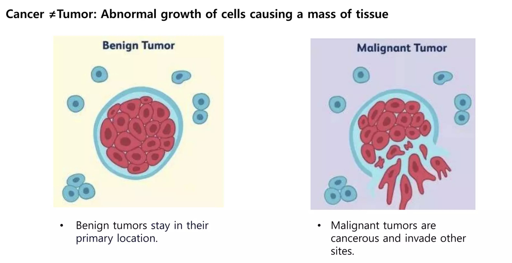

# Breast Cancer Prediction

## Introduction
Breast Cancer Prediction is a project aimed at utilizing machine learning techniques to predict the diagnosis of breast tumors as either benign or malignant. Breast cancer is a significant global health concern, and accurate diagnosis plays a crucial role in treatment planning and patient outcomes.

## Dataset
The project utilizes the Breast Cancer Wisconsin (Diagnostic) Data Set, which contains information from 569 samples of breast tumor cells. Each sample is labeled as either malignant (cancerous) or benign (non-cancerous), and features such as radius, texture, perimeter, area, and others are used to predict the diagnosis.

## Methodology
The project employs various machine learning classification algorithms, including Logistic Regression, k-Nearest Neighbors, Random Forest Classifier, and Support Vector Machine. These algorithms are trained on the dataset to learn patterns and make predictions regarding the nature of breast tumors.

## Results

| Algorithm                | Test Accuracy |
|--------------------------|---------------|
| Logistic Regression      | 90.35%        |
| k-Nearest Neighbors      | 98.25%        |
| Random Forest Classifier | 96.49%        |
| Support Vector Machine   | 94.74%        |

## Conclusion
The project concludes that the k-Nearest Neighbors algorithm demonstrated the highest accuracy of **98.25%**, making it the most effective model for predicting breast cancer in this dataset. These results highlight the potential of machine learning in aiding accurate diagnosis and improving patient outcomes in breast cancer management.

## Usage
1. Clone the repository.
2. Install the required dependencies (`numpy`, `pandas`, `scikit-learn`, etc.).
3. Run the provided scripts or notebooks to train and evaluate the machine learning models.
4. Analyze the results and explore further improvements or optimizations.

## References
- Breast Cancer Wisconsin (Diagnostic) Data Set: [UCI Machine Learning Repository](https://archive.ics.uci.edu/ml/datasets/Breast+Cancer+Wisconsin+%28Diagnostic%29)
- World Health Organization (WHO) - Breast Cancer: [Fact Sheet](https://www.who.int/news-room/fact-sheets/detail/breast-cancer)
  
